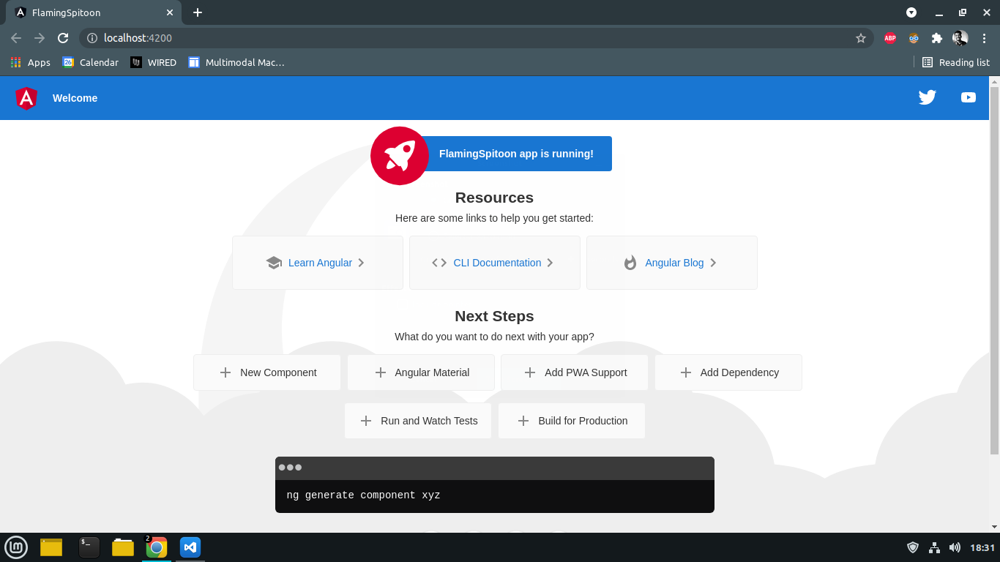
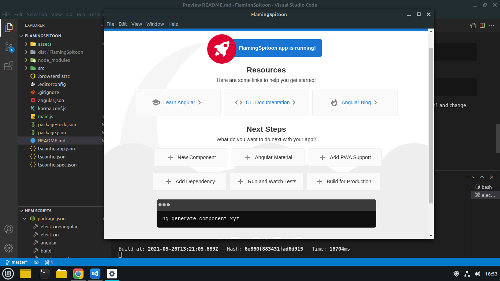

# Flaming Spitoon

## Template repo to get started with electron and angular

## Prerequisites

1. Node and NPM ( use nvm to install node and npm on linux)
2. Angular-cli must be installed globally
   ```bash
       npm install -g @angular/cli
   ```

## To get started

1. Start a new angular project <br>
   ```bash
       ng new projectName --skip-git
   ```
2. Make sure angular is up by running

   ```bash
       ng serve
   ```

   

3. Install electron

   ```bash
       npm install electron -D
   ```

4. Create a main.js file in the projectfolder and copy the boilerplate code from [here](https://gist.github.com/asishRye/cb584ef15bd10dbeaef1925c0d52a790)
   Make sure you add the name of your project in line 19

5. Add the following entry to package.json file
   ```bash
       "main": "main.js",
   ```
6. To start your electron+angular project run

   ```bash
        ng build && electron .
   ```

   Sometimes electron app starts with an empty white screen, in that case open this file `dist/yourprojectName/index.html` and change `<base href="/">` to `<base href="./">` and press Ctrl+R in the electron app.

   
